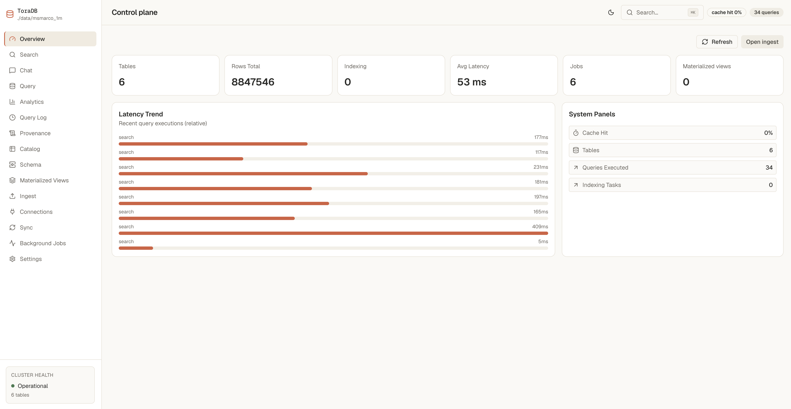

# ToraDB

Retrieval-focused database for local text, vector, and hybrid search — with a Python SDK, CLI, and retrieval SQL.



## Features

- **Local on-disk tables** — Parquet segments, index sidecars, WAL replay
- **Text, vector, hybrid** — BM25, dense ANN (HNSW / DiskANN), fusion
- **SQL + SDK** — `SELECT` with sparse/vector search, GROUP BY, materialized views
- **CLI** — ingest, query, reindex, catalog helpers

## Quick start

Install from [PyPI](https://pypi.org/project/toradb/):

```bash
python3 -m venv .venv
source .venv/bin/activate
pip install toradb

toradb smoke
```

Clone the repo to run the bundled example:

```bash
git clone https://github.com/sophatvathana/toradb.git
cd toradb
python examples/full_example.py
```

To hack on ToraDB itself, see [Install](mdx/install.mdx) (build from source with `maturin develop`).

## Documentation

| Topic | Link |
|-------|------|
| **PyPI** | [pypi.org/project/toradb](https://pypi.org/project/toradb/) |
| **Docs site** | [toradb.mintlify.app](https://toradb.mintlify.app) *(Mintlify; update URL after deploy)* |
| GitHub hub | [docs/README.md](docs/README.md) |
| Install | [mdx/install](mdx/install.mdx) or published `/install` |
| Quickstart | [mdx/quickstart](mdx/quickstart.mdx) or published `/quickstart` |
| Contributing | [docs/CONTRIBUTING.md](docs/CONTRIBUTING.md) |
| Security | [docs/SECURITY.md](docs/SECURITY.md) |

Edit the docs site: `cd mdx && mint dev` — see [mdx/README.md](mdx/README.md).

## Development

```bash
cargo test
pytest tests/python_smoke.py -q
```

## Platform Dashboard (Rust API + UI)

```bash
cd apps/platform && pnpm install && pnpm build
cd ../..
cargo run -p toradb-cli --bin toradb-ingest -- platform serve --db examples/_demo_db --static-dir apps/platform/out --addr 127.0.0.1:8787
```

Open `http://127.0.0.1:8787` for the embedded dashboard + API server.

## License

Licensed under the [Apache License, Version 2.0](LICENSE).
