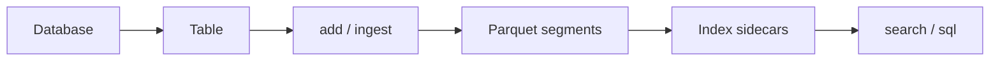

ToraDB organizes data as a **local database directory** containing **tables**. Each table holds documents (text and optional vectors/metadata), stored in Parquet **segments** with optional **index sidecars** for fast retrieval.

## Flow

## Core objects

| Object | Role |
|--------|------|
| `Database` | Open a path on disk (`toradb.local(path)`). |
| `Table` | Named collection of documents; created with `mode="text"` or `mode="hybrid"`. |
| `SearchResults` | Ranked hits from `table.search` or retrieval `SELECT`. |
| `SearchResults.provenance` | Structured JSON trace of candidate flow across retrieval tiers (when `explain=True`). |
| Analytics result | Tabular output from `GROUP BY` / aggregates via `db.sql`. |

## Two ways to query

1. **Python SDK** — `table.search(...)` for retrieval; `db.sql(...)` for SQL.
2. **CLI** — `toradb query`, `toradb sql`, `toradb tables`, `toradb reindex`.

Indexes are built automatically on ingest where possible; use [reindex and compact](/guides/reindex-compact) to rebuild BM25, HNSW, or DiskANN after bulk changes.

## Related

- [Table modes](/concepts/table-modes)
- [On-disk layout](/concepts/on-disk-layout)
- [Python SDK guide](/guides/python)
- [Retrieval provenance](/guides/provenance)
